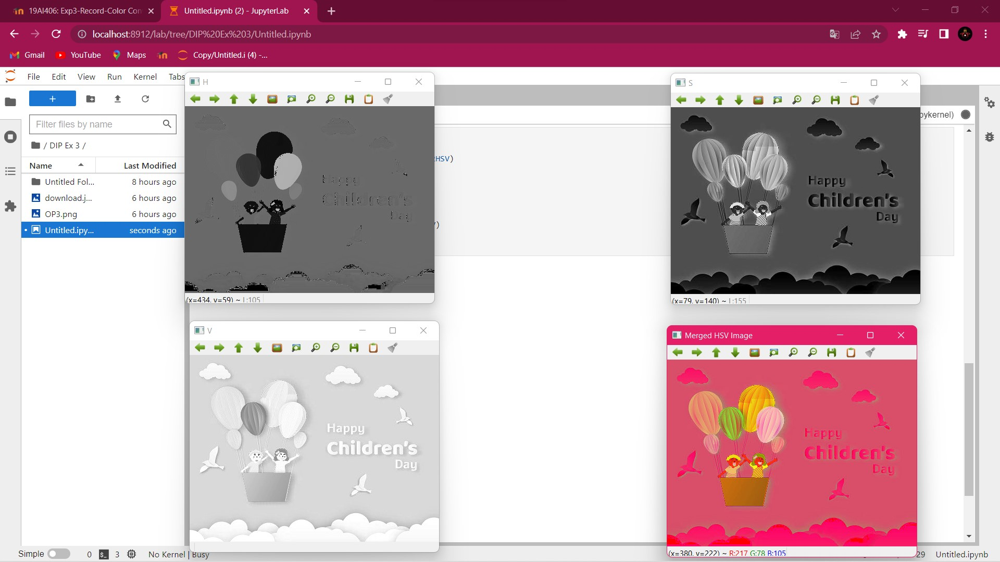

# Color Conversion
## AIM
To perform the color conversion between RGB, BGR, HSV, and YCbCr color models.

## Software Required:
Anaconda - Python 3.7
## Algorithm:
### Step1:
Import CV2 library.
<br>
### Step2:
Use cv2.cvtcolor() to convert colot in required image
<br>
### Step3:
Use .imshow() to display and .imwrite() to save.
<br>
### Step4:
Use split() to disperse color into separate channels.
<br>
### Step5:
Use merge() to combine those separate channels into color.
<br>

## Program:
```python
# Developed By: Yuvadarshini S
# Register Number: 212221230126
# i) Convert BGR and RGB to HSV and GRAY

import cv2
house_color_image = cv2.imread('download.jpg')
cv2.imshow('Original image',house_color_image)
#BGR 2 HSV
hsv_image = cv2.cvtColor(house_color_image, cv2.COLOR_BGR2HSV)
cv2.imshow('BGR2HSV',hsv_image)
#RGB 2 HSV
hsv_image1 = cv2.cvtColor(house_color_image, cv2.COLOR_RGB2HSV)
cv2.imshow('RGB2HSV',hsv_image1)
# BGR 2 GRAY
gray_image = cv2.cvtColor(house_color_image, cv2.COLOR_BGR2GRAY)
cv2.imshow('BGR2GRAY',gray_image)
# RGB 2 GRAY
gray_image1 = cv2.cvtColor(house_color_image, cv2.COLOR_RGB2GRAY)
cv2.imshow('RGB2GRAY',gray_image1)

cv2.waitKey(0)
cv2.destroyAllWindows()

# ii)Convert HSV to RGB and BGR

import cv2
sun_color_image = cv2.imread('download.jpg')
cv2.imshow('Original image', sun_color_image)
hsv_image = cv2.cvtColor(sun_color_image, cv2.COLOR_HSV2RGB)
cv2.imshow('HSV2RGB' ,hsv_image )
gray_image1 = cv2.cvtColor (sun_color_image, cv2.COLOR_HSV2BGR)
cv2.imshow('HSV2BGR', gray_image1)
cv2.waitKey(0)
cv2. destroyAllWindows()

# iii)Convert RGB and BGR to YCrCb

import cv2
sun_color_image = cv2.imread('download.jpg')
cv2.imshow('Original image', sun_color_image)
gray_image1 = cv2.cvtColor (sun_color_image, cv2.COLOR_RGB2YCrCb)
cv2.imshow('RGB2YCrCb', gray_image1)
gray_image1 = cv2.cvtColor (sun_color_image, cv2.COLOR_BGR2YCrCb)
cv2.imshow('BGR2YCrCb', gray_image1)
cv2.waitKey(0)
cv2. destroyAllWindows()

# iv)Split and Merge RGB Image

import cv2
image = cv2.imread('download.jpg')
blue=image[:,:,0]
green=image[:,:,1]
red=image[:,:,2]
cv2.imshow('B-Channel',blue)
cv2.imshow('G-Channel',green)
cv2.imshow('R-Channel',red)
merged_BGR=cv2.merge((blue,green,red))
cv2.imshow('Merged BGR Image',merged_BGR)
cv2.waitKey(0)
cv2.destoryAllWindows()

# v) Split and merge HSV Image

import cv2
house_color_image=cv2.imread('download.jpg')
h, s, v = cv2.split(house_color_image)
cv2.imshow('H',h)
cv2.imshow('S',s)
cv2.imshow('V',v)
merge_hsv=cv2.merge((h,s,v))
cv2.imshow('merge_hsv',merge_hsv)
cv2.waitKey(0)
cv2.destroyAllWindows()

```
## Output:
### i) BGR and RGB to HSV and GRAY

<br>
<br>

### ii) HSV to RGB and BGR

<br>
<br>

### iii) RGB and BGR to YCrCb

<br>
<br>

### iv) Split and merge RGB Image

<br>
<br>

### v) Split and merge HSV Image

<br>
<br>


## Result:
Thus the color conversion was performed between RGB, HSV and YCbCr color models.
